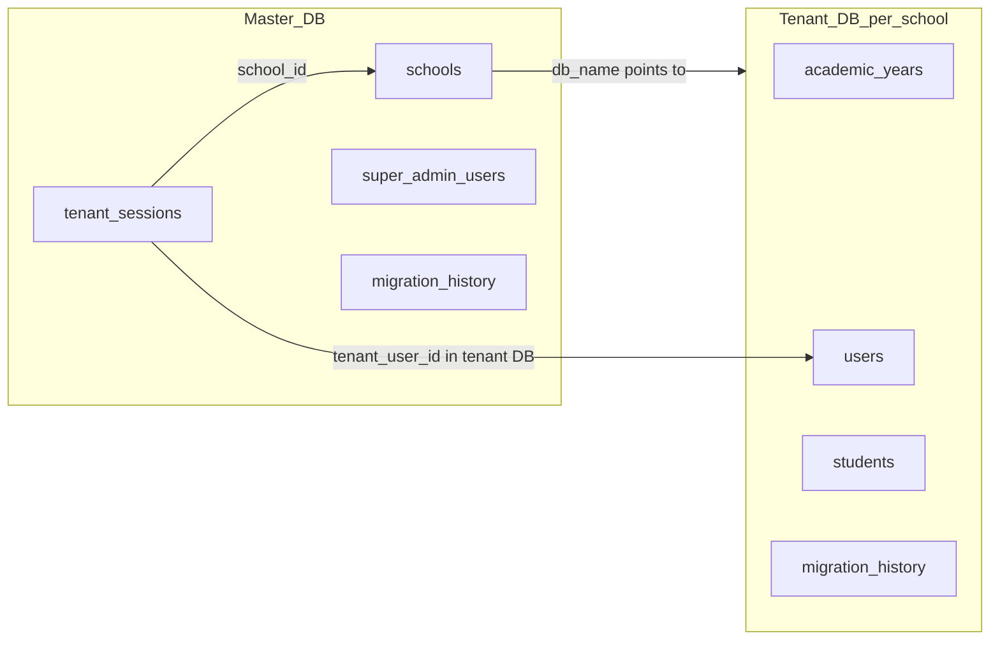
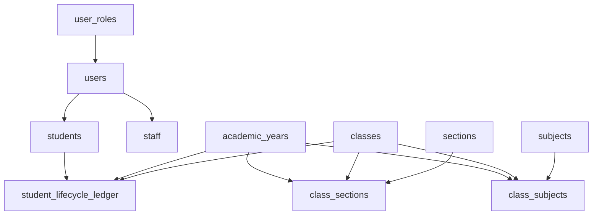

# Database overview for developers

This document describes how PostgreSQL is used in this project: the split between **master** (platform) and **tenant** (per-school) databases, how migrations run, and how major tables connect. The canonical DDL lives under [`migrations/`](../migrations/).

---

## Architecture: master vs tenant

- **Master database** stores the school registry, super-admin accounts, and tenant session binding. Schema file: [`migrations/master/masters_schema.sql`](../migrations/master/masters_schema.sql).
- **Tenant database** (one PostgreSQL database per school) holds all school operational data: users, students, classes, fees, exams, transport, library, and so on. Baseline schema: [`migrations/tenant/schema.sql`](../migrations/tenant/schema.sql).

The application resolves which tenant database to use using environment variables and school registry rows; see [`src/config/database.js`](../src/config/database.js) (for example `MASTER_DATABASE_URL`, `DATABASE_URL`, `DB_NAME`, `TENANT_ADMIN_DATABASE_URL`, and `SCHOOL_DATABASE_URL_MAP` for per-school URL overrides).



**Master tables (summary)**

| Table | Role |
|-------|------|
| `schools` | One row per school; `institute_number`, `db_name` (actual Postgres DB name), `status`. |
| `super_admin_users` | Platform operators (not school staff). |
| `tenant_sessions` | Binds a session hash to `school_id`, `db_name`, and `tenant_user_id` (user id inside that school’s database). |
| `super_admin_audit_log` | Audit trail for super-admin actions. |
| `migration_history` | Tracks applied SQL files on the master database. |

There are **no foreign keys** from tenant databases back to master; the link is logical (`schools.db_name`, session payload).

---

## How migrations work

### Tracking

Both master and tenant databases use a `migration_history` table (`migration_name` unique). Runners skip files already recorded.

### Master schema

```bash
cd server
npm run db:master:migrate
```

This runs [`scripts/db-runner.js`](../scripts/db-runner.js) with `--db master` against master connection env vars (`DB_MASTER_HOST`, `DB_MASTER_NAME`, etc.—see script and `.env.example`).

### Tenant schema on all active schools

```bash
npm run db:tenants:migrate:all
```

[`scripts/tenant-bulk-runner.js`](../scripts/tenant-bulk-runner.js) loads `db_name` from `public.schools` where `status = 'active'`, then runs each `.sql` file in the given path(s). When the path is a **directory**, it collects all `.sql` files, sorts them alphabetically, and forces `schema.sql` first.

### New tenant provisioning

When a new school database is created, [`src/services/tenantProvisioningService.js`](../src/services/tenantProvisioningService.js) applies the tenant template (`migrations/tenant/schema.sql` by default), seeds, then runs **sorted** `migrations/tenant/*.sql` excluding duplicate handling for `schema.sql` via `migration_history`.

### Seeds and demos

- `npm run db:project:setup` / `npm run db:demo:setup` chain master migrate, seeds, and tenant steps as defined in [`package.json`](../package.json).

### Legacy and backup SQL

[`migration_backup/`](../migration_backup/) holds older monolithic init scripts (for example `001_init_full_schema.sql`) and archived patches. Prefer the **`migrations/master`** and **`migrations/tenant`** workflow above unless you are recovering history.

---

## Important caveat: files under `migrations/` root

Several numbered SQL files sit directly under [`migrations/`](../migrations/) (for example `052_*.sql`–`057_*.sql`, `055_api_compatibility_views.sql`). They are **not** picked up by `npm run db:tenants:migrate:all`, which only targets **`migrations/tenant/`**.

- Confirm with your team whether those root-level scripts are already reflected in `schema.sql` or were applied manually on specific environments.
- For repeatable provisioning, consider moving idempotent patches into `migrations/tenant/` with timestamp prefixes or merging them into `schema.sql` when appropriate.

---

## Tenant schema: domains and relationships

The tenant [`schema.sql`](../migrations/tenant/schema.sql) defines 70+ tables. Below is a **domain map** (not every column or index).

### 1. Temporal anchor: `academic_years`

- Defines school sessions with `start_date` / `end_date`.
- **Non-overlapping** sessions via `btree_gist` EXCLUDE constraint on `daterange`.
- At most one row with `is_current = true` (partial unique index).

Most operational rows include `academic_year_id` pointing here.

### 2. Identity and HR

- **`user_roles` → `users`**: login identity; `role_id` references roles.
- **`staff`**: `user_id` UNIQUE → `users`; links to `departments`, `designations`.
- **Salary**: `staff_salary_assignments`, `staff_salary_component_values`, `staff_payslips` chain off `staff`.
- **`students`**: `user_id` UNIQUE → `users`; demographic FKs to lookups (`blood_groups`, `religions`, `casts`, `mother_tongues`, `houses`).
- **`guardians`** + **`student_guardian_links`**: many-to-many between students and guardians.

Incremental DDL note: [`migrations/tenant/20260504161200_add_house_columns.sql`](../migrations/tenant/20260504161200_add_house_columns.sql) adds `house_color`, `house_captain` on `houses`.

### 3. Academic structure (triple-key pattern)

Core entities:

- `classes`, `sections`, `subjects` — relatively stable catalogs.
- **`class_sections`**: which section exists for which class **in a given year** (`class_id`, `section_id`, `academic_year_id`). Unique anchor `(id, class_id, academic_year_id)`.
- **`class_subjects`**: curriculum line per class/year/subject; same triple-key anchor pattern.

Child tables (examples: `class_teachers`, `subject_teacher_assignments`, `student_subject_choices`) use **composite foreign keys** so a child row cannot reference a `class_section_id` or `class_subject_id` that belongs to a different `class_id` or `academic_year_id`. This is easy to get wrong in application code if you only join on surrogate `id`.

Sections soft-delete columns were added in [`migrations/tenant/20260504166000_add_sections_missing_columns.sql`](../migrations/tenant/20260504166000_add_sections_missing_columns.sql) (`updated_at`, `deleted_at`).

### 4. Enrollment and lifecycle

**`student_lifecycle_ledger`** is the source of truth for admission, promotion, detain, leave, rejoin, transfer. It carries `from_*` / `to_*` academic year, class, and section references and defines uniqueness anchors such as `(id, student_id, to_academic_year_id, to_class_id)` so other modules can lock to a specific enrollment state.

Downstream examples:

- **`student_attendance`** ties to `student_lifecycle_ledger` (temporal anchor comments in schema).
- **`transport_allocations`** (for students) FK to `(student_lifecycle_id, student_id, academic_year_id)` → `student_lifecycle_ledger`.
- **Library** `library_book_issues` and `library_book_reservations` use the same lifecycle composite FK for student borrowers.

### 5. Fees

- **`fees_types`** → **`fees`** scoped by `class_id` and `academic_year_id` with composite uniqueness.
- **`fees_class_types`**, **`fees_installments`**, **`fees_paids`**, **`compulsory_fees`**, **`optional_fees`**, **`fees_advance`** link students and sessions to fee definitions and payments.

### 6. Exams and results

- **`exams`** → **`exam_classes`** / **`exam_schedules`** → **`exam_results`** (with `exam_grades`, staff who entered marks).

### 7. Timetable and attendance

- **`timetable_time_slots`**, **`class_rooms`**, **`class_schedules`** link academic year, rooms, slots, teachers (`staff`), `class_sections`, and `class_subjects`.
- **`student_attendance`**, **`staff_attendance`**, **`leave_applications`**.

### 8. Transport

- **`routes`** → **`pickup_points`** (`route_id`); **`transport_vehicles`**; **`vehicle_route_assignments`** (vehicle + driver `staff_id` + academic year + non-overlapping `valid_period`).
- **`transport_fee_master`** (pricing per year / pickup / plan); **`transport_allocations`** assign either a **student** or **staff** (XOR), route, stop, optional fee row; enforces pickup belonging to route via `(pickup_point_id, route_id)` FK.

Transport-related incremental migrations add columns such as `is_active`, vehicle registration/chassis/GPS fields, and `transport_fee_master.duration_days` / `status`:

- [`20260504165500_add_transport_missing_columns.sql`](../migrations/tenant/20260504165500_add_transport_missing_columns.sql)
- [`20260504165000_add_transport_fee_columns.sql`](../migrations/tenant/20260504165000_add_transport_fee_columns.sql)

### 9. Library

- **`library_categories`** → **`library_books`** → **`library_book_copies`**.
- **`library_policies`**, **`library_book_issues`**, **`library_book_reservations`**, **`library_members`** (student XOR staff per academic year).

### 10. Finance (school ledger)

- **`account_categories`** → **`financial_ledger`**; **`accounts_invoices`**.

### 11. Communications and misc

- Chats, emails, notes, todos, calls; **`events`**, **`notice_board`**, **`calendar_events`**; **`documents`** / **`files`**; **`settings`**, **`school_profile`**.

---

## Simplified diagram: identity and academic spine



---

## Composite keys and application code

When inserting or updating rows that reference `class_sections`, `class_subjects`, or `student_lifecycle_ledger`, align **all** FK columns that the schema declares—not only the surrogate `id`. Otherwise PostgreSQL will reject the statement or you may join inconsistent rows in queries.

Illustrative patterns from [`migrations/tenant/schema.sql`](../migrations/tenant/schema.sql):

- `class_teachers`: `FOREIGN KEY (class_section_id, class_id, academic_year_id) REFERENCES class_sections(id, class_id, academic_year_id)`
- `student_subject_choices`: `FOREIGN KEY (class_subject_id, class_id, academic_year_id) REFERENCES class_subjects(id, class_id, academic_year_id)`
- `transport_allocations` (students): `FOREIGN KEY (student_lifecycle_id, student_id, academic_year_id) REFERENCES student_lifecycle_ledger(id, student_id, to_academic_year_id)`

---

## Where to look next

| Need | Location |
|------|----------|
| Full tenant DDL | [`migrations/tenant/schema.sql`](../migrations/tenant/schema.sql) |
| Incremental tenant patches | [`migrations/tenant/*.sql`](../migrations/tenant/) (timestamp-prefixed files after `schema.sql`) |
| Master DDL | [`migrations/master/masters_schema.sql`](../migrations/master/masters_schema.sql) |
| Migration runners | [`scripts/db-runner.js`](../scripts/db-runner.js), [`scripts/tenant-bulk-runner.js`](../scripts/tenant-bulk-runner.js) |
| Runtime DB routing | [`src/config/database.js`](../src/config/database.js) |
| Historical / pg_dump notes | [`migration_backup/migrations/README.md`](../migration_backup/migrations/README.md) |

---

## Optional: generating a visual ER diagram

The repo does not ship a rendered ER diagram. Common approaches:

- **pgAdmin**: reverse-engineer schema from a connected database.
- **SchemaSpy** or similar: generate HTML docs from a JDBC URL or live DB.
- **SQL**: query `information_schema.table_constraints` and `information_schema.key_column_usage` for FK lists.

For accuracy, generate diagrams from the **same database** you run migrations against after applying [`migrations/tenant/schema.sql`](../migrations/tenant/schema.sql) plus all tenant incrementals.
